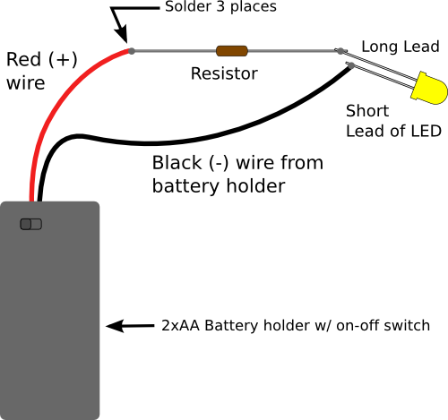
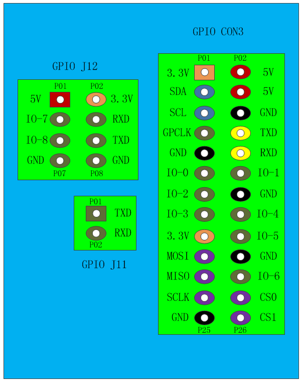

# bpi_led_test

Initial wiring test for the Banana Pi (BPI-M1)

# Motivation

In contrast to the Raspberry Pi the Banana Pi does wiring internally a little bit different when it comes to things like GPIO, SPI, PWM and things like that. So we have to check out how this works first: We use switching on and off a LED for that.

## References

* Examples doing this can be found [here (wiki lemaker)](http://wiki.lemaker.org/BananaPro/Pi:GPIO_library#The_simplest_program:_Blink) and [here (github lemaker)](https://github.com/LeMaker/WiringBP). Also [here](https://blog.mayer.tv/2016/01/08/bananapi-gpio-wiringbp.html).
* A good overview of the BPI-M1 can be found [here](http://wiki.banana-pi.org/Banana_Pi_BPI-M1%2B).

# Connecting the LED

Be sure to use a resistor and also connect the correct side of the LED (long lead) to +.

## Resistor tables

* [How many Ohm for the Volts?](https://kithub.cc/2015/11/how-many-volts-are-needed-to-power-an-led-2/)
* [Resistor Calculator (german)](https://www.elektronik-kompendium.de/sites/bau/1109111.htm)
* [Resistor Color Coding (german)](https://www.elektronik-kompendium.de/sites/bau/1109051.htm)

## Pins

# Compile and install wiringBP library and tools

Clone the [repository](https://github.com/LeMaker/WiringBP) and run `./build`. This installs includes and library in */usr/local/include* and */usr/local/lib*.

# Compile and install

Go to the *source* directory and use the mighty force of shining CMake :D to compile the pico project.  
The *wiringPi* sub folder contains the internal interface library for the installed wiringBP library.  

(I used Armbian stretch on the Banana Pi but also more recent versions should work).